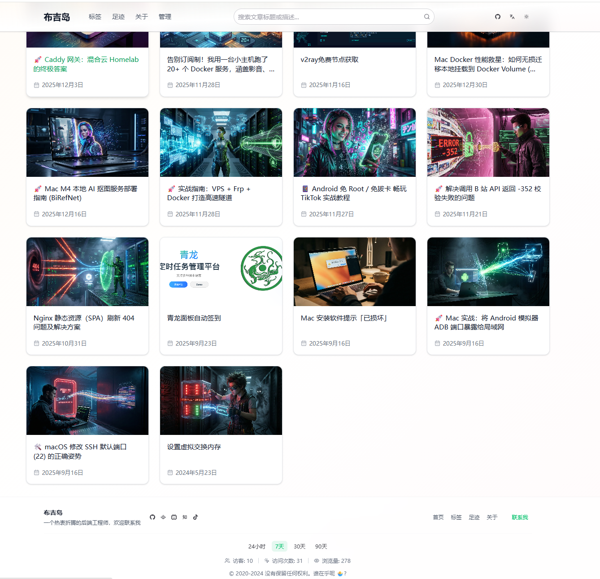
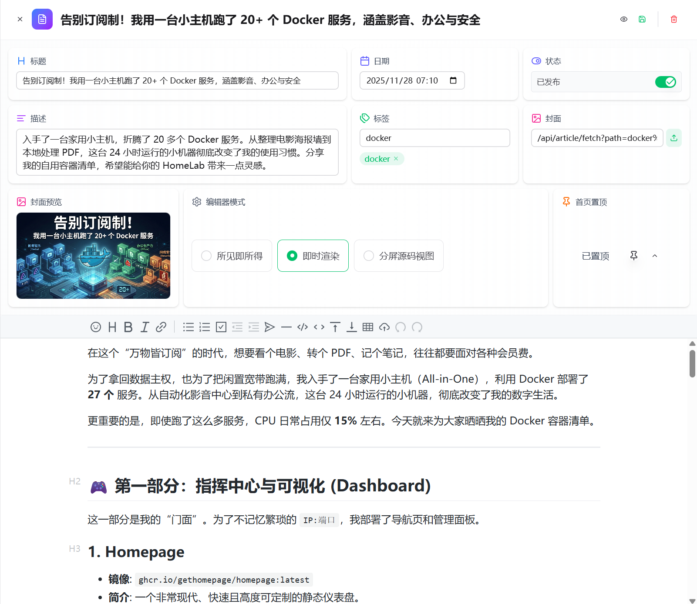

# Nuxt Blog Site [![zread](https://img.shields.io/badge/Ask_Zread-_.svg?style=flat&color=00b0aa&labelColor=000000&logo=data%3Aimage%2Fsvg%2Bxml%3Bbase64%2CPHN2ZyB3aWR0aD0iMTYiIGhlaWdodD0iMTYiIHZpZXdCb3g9IjAgMCAxNiAxNiIgZmlsbD0ibm9uZSIgeG1sbnM9Imh0dHA6Ly93d3cudzMub3JnLzIwMDAvc3ZnIj4KPHBhdGggZD0iTTQuOTYxNTYgMS42MDAxSDIuMjQxNTZDMS44ODgxIDEuNjAwMSAxLjYwMTU2IDEuODg2NjQgMS42MDE1NiAyLjI0MDFWNC45NjAxQzEuNjAxNTYgNS4zMTM1NiAxLjg4ODEgNS42MDAxIDIuMjQxNTYgNS42MDAxSDQuOTYxNTZDNS4zMTUwMiA1LjYwMDEgNS42MDE1NiAxLjMxMzU2IDUuNjAxNTYgNC45NjAxVjIuMjQwMUM1LjYwMTU2IDEuODg2NjQgNS4zMTUwMiAxLjYwMDEgNC45NjE1NiAxLjYwMDFaIiBmaWxsPSIjZmZmIi8%2BCjxwYXRoIGQ9Ik00Ljk2MTU2IDEwLjM5OTlIMi4yNDE1NkMxLjg4ODEgMTAuMzk5OSAxLjYwMTU2IDEwLjY4NjQgMS42MDE1NiAxMS4wMzk5VjEzLjc1OTlDMS42MDE1NiAxNC4xMTM0IDEuODg4MSAxNC4zOTk5IDIuMjQxNTYgMTQuMzk5OUg0Ljk2MTU2QzUuMzE1MDIgMTQuMzk5OSA1LjYwMTU2IDE0LjExMzQgNS42MDE1NiAxMy43NTk5VjExLjAzOTlDNS42MDE1NiAxMC42ODY0IDUuMzE1MDIgMTAuMzk5OSA0Ljk2MTU2IDEwLjM5OTlaIiBmaWxsPSIjZmZmIi8%2BCjxwYXRoIGQ9Ik0xMy43NTg0IDEuNjAwMUgxMS4wMzg0QzEwLjY4NSAxLjYwMDEgMTAuMzk4NCAxLjg4NjY0IDEwLjM5ODQgMi4yNDAxVjQuOTYwMUMxMC4zOTg0IDUuMzEzNTYgMTAuNjg1IDUuNjAwMSAxMS4wMzg0IDUuNjAwMUgxMy43NTg0QzE0LjExMTkgNS42MDAxIDE0LjM5ODQgNS4zMTM1NiAxNC4zOTg0IDQuOTYwMVYyLjI0MDFDMTQuMzk4NCAxLjg4NjY0IDE0LjExMTkgMS42MDAxIDEzLjc1ODQgMS42MDAxWiIgZmlsbD0iI2ZmZiIvPgo8cGF0aCBkPSJNNCAxMkwxMiA0TDQgMTJaIiBmaWxsPSIjZmZmIi8%2BCjxwYXRoIGQ9Ik00IDEyTDEyIDQiIHN0cm9rZT0iI2ZmZiIgc3Ryb2tlLXdpZHRoPSIxLjUiIHN0cm9rZS1saW5lY2FwPSJyb3VuZCIvPgo8L3N2Zz4K&logoColor=ffffff)](https://zread.ai/chao-eng/nuxt-blog-site)

> 一个现代化、全栈式的个人博客系统。基于 Nuxt 3 构建，兼具静态站的**物理透明性**与动态博客的**在线管理体验**。

---

## ✨ 核心亮点：像管理动态站一样管理你的纯 Markdown 博客

**告别“本地编辑 -> Git 提交 -> 推送 -> 等待构建”的繁琐流程。**

本项目的初衷是解决静态博客发布不便的问题，让你随时随地通过浏览器记录灵感：

*   **🚀 强大的在线管理**：内置高性能后台管理系统，支持在线创建、编辑文章，实时预览，即时保存。
*   **💾 物理 Markdown 存储**：文章以纯 `.md` 文件形式存储在服务器磁盘（或 S3）。数据透明、无锁死、易于迁移。
*   **⚡ 零构建发布**：修改文章后实时生效，无需触发耗时的静态构建流程。
*   **📦 全栈集成**：集成评论 (Giscus)、统计 (Umami)、足迹 (ECharts)、多语言 (i18n) 等常用模块。

---

## 📸 预览截图

### 1. 简洁响应式前台


### 2. 沉浸式在线编辑器


---

## 🏗️ 架构与技术栈

本项目采用 Nuxt 4 (Nuxt 3 最新 release) 架构，前后端紧密集成。

| 类别 | 技术/库 | 说明 |
| :--- | :--- | :--- |
| **基础框架** | [Nuxt 4 / 3](https://nuxt.com) | 提供 SSR、全栈 API 引擎 (Nitro) |
| **UI 框架** | [Nuxt UI](https://ui.nuxt.com) | 基于 TailwindCSS 的全套 UI 组件 |
| **数据库** | [SQLite](https://github.com/WiseLibs/better-sqlite3) | 零配置、极速，支撑系统设置与账户管理 |
| **文件管理** | Local / S3 | 支持服务器本地存储或 **AWS S3** 对象存储 |
| **身份认证** | [Nuxt Auth](https://sidebase.io/nuxt-auth) | 基于 JWT 的安全登录方案 |
| **足迹地图** | [ECharts](https://echarts.apache.org) | 交互式旅行轨迹展示 |
| **编辑器** | [Vditor](https://github.com/Vanessa219/vditor) | 工业级 Markdown 编辑体验 |

---

## ✨ 功能清单

### 🖥️ 前台：极致的阅读体验
*   **响应式设计**：完美适配 PC、平板及手机访问。
*   **主题切换**：支持深色模式 (Dark Mode) 与系统同步。
*   **多语言支**：内置中英文全站翻译，通过 `i18n` 驱动。
*   **性能优化**：SSR 渲染保证极速秒开与最佳的 SEO 表现。
*   **文章检索**：支持分页、标签分类、快速检索。
*   **评论系统**：集成 Giscus 评论系统，基于 GitHub Discussions。

### 🔐 后台：极简的管理能力
*   **仪表盘**：系统数据一览，包括运行时间、文章统计。
*   **文章管理**：
    *   **所见即所得**：Markdown 编辑、侧边实时预览。
    *   **元数据控制**：快捷设置封面图、文章路径、置顶状态等。
    *   **发布控制**：支持“草稿/发布”状态一键切换。
*   **S3 强力集成**：
    *   支持配置 S3 兼容的对象存储（OSS/MinIO/S3）。
    *   **新增：支持自定义存储路径配置**，方便管理不同项目的资源。
*   **旅行足迹**：可视化管理旅行城市，支持上传旅行照片，并与博文关联。
*   **系统配置**：
    *   在线配置 Giscus 评论、Umami 统计，**即配即用，无需修改代码**。

---

## 🚀 快速开始

### 运行环境
*   Node.js >= 20.0
*   Yarn / NPM / PNPM

### 本地开发
1.  **克隆仓库**:
    ```bash
    git clone https://github.com/chao-eng/nuxt-blog-site.git
    cd nuxt-blog-site
    ```
2.  **安装依赖**:
    ```bash
    yarn install
    ```
3.  **配置环境**:
    复制 `.env.example` 并重命名为 `.env`。
4.  **启动开发服务**:
    ```bash
    yarn dev
    ```

---

## 📦 部署指南

### Docker 部署 (最推荐)
项目已提供高度集成的镜像，支持 `amd64` 和 `arm64` 架构。

```bash
docker run -d -p 3000:3000 \
  -v $(pwd)/data:/app/data \
  -v $(pwd)/data/blog:/app/blog \
  -v $(pwd)/public/uploads:/app/static \
  --name nuxt-blog \
  bujidec/nuxt-blog-site:latest
```

**挂载目录说明：**
*   `/app/data`: 存放 SQLite 数据库文件。
*   `/app/blog`: 存放 Markdown 文章源文件。
*   `/app/static`: 存放本地上传的图片资源（如不使用 S3）。

---

## ⚙️ 个性化定制

### 1. 站点全局信息
修改根目录下的 `app_config.yml` 文件，即可快速自定义：
*   网站标题、作者简介、社交链接（Github, 知乎, Bilibili 等）。
*   SEO 常规元数据。

### 2. S3 存储配置
进入后台「系统设置 -> S3 配置」，填写你的 AccessKey/SecretKey。支持指定存储路径（如 `my-blog/attachments/`），实现灵活隔离。

---

## 📄 开源协议
本项目采用 [MIT License](LICENSE)。

感谢所有为本项目提供灵感的开源社区工具！
